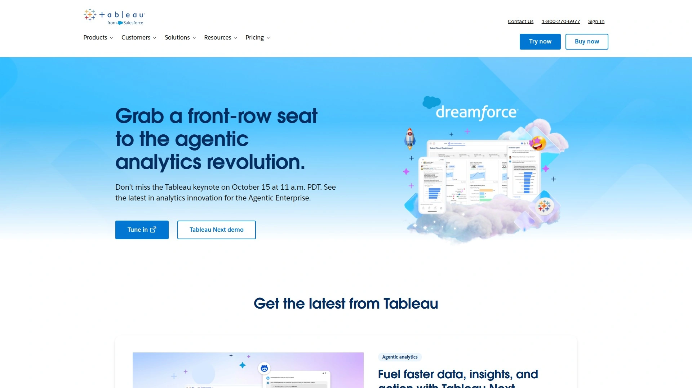

# 2025年排名前18的广告创意分析工具汇总(最新整理)

投放Meta、TikTok广告时,你是否总在猜测哪个素材真正有效?创意团队和投放团队看着同一份数据,却得出完全不同的结论?好的创意分析工具能让你看清每个广告素材的表现逻辑,快速找到能拉新、能转化的创意模式,而不是在一堆指标里迷路。这份清单覆盖从视觉报告、AI标签、多账户管理到归因整合的工具,适合DTC品牌、代理商和增长团队快速定位适合自己的平台,把创意决策建立在数据基础上,而不是靠感觉。

## **[Motion](https://motionapp.com)**

付费社交广告创意的可视化分析中枢,专为增长与创意团队协作设计。

Motion把Meta、TikTok、YouTube、LinkedIn的广告素材和数据拉到一个报告里,自动把相似创意分组,让你一眼看出哪种钩子、哪种格式、哪种信息真正推动转化。不用再盯着一个个单独的广告数据发呆,而是从创意模式的层面理解表现。它的AI功能会逐帧分析视频,告诉你该优化什么、下一条广告该怎么迭代,还能给出数据支撑的建议直接发给剪辑师和设计师。

**核心功能聚焦实战场景:**报告自动更新不会断链,分享时可以隐藏敏感数据给自由职业者或外部团队看,支持Northbeam和GA4集成拉入第三方归因数据。Jones Road用它追踪新品发布后创意和信息的调整效果,HexClad在大促时搭建顶级广告报告并叠加Northbeam的ROAS和CPA指标,Ridge用它监控新的高消耗广告快速加码赢家。

**适合谁:**需要把创意表现和投放数据打通的DTC品牌、代理商创意总监、performance marketer,以及管理多个客户账户需要快速生成客户报告的团队。Motion在创意和数据之间架了一座桥,让两边的人终于能用同一种语言说话。

**定价与上手:**提供14天免费AI创意策略师试用,包含Meta账户接入、AI专家工具、无限用户和广告排行榜;付费的Creative Analytics方案起步价250美元/月,解锁高级创意报告、自定义标签、无限工作区和账户、以及Northbeam/GA整合。

***

## **[Superads](https://www.superads.ai)**

现代付费社交的指挥中心,用AI驱动的创意洞察帮你更快做决策。

Superads把TikTok、Meta、LinkedIn的创意表现拆到hook、格式、情绪触发点、CTA这些维度,你终于能明白一个广告为什么有效,而不只是知道它有效。数据每天自动从账户拉取,零手动操作,AI Copilot让你用日常语言提问就能立刻得到答案。Boards和自定义看板可以按具体campaign、客户或创意主题组织报告,适配任何工作流。多账户分析功能把多个TikTok账户甚至跨平台数据放在一个界面,一键分享看板给团队或客户,报告自动更新,协作毫无阻力。

定价友好且功能丰富:免费方案已经很能打,付费专业版从49美元/月起步,包含免费试用。对于需要快速迭代、智能测试、规模化有效创意的团队来说,Superads把创意和表现之间的反馈循环缩到最短。

***

## **[Segwise](https://segwise.ai)**

AI驱动的创意分析平台,自动给广告里的每个元素打标签并关联表现指标。

Segwise用多模态AI自动标注图片、视频、音频、可玩广告里的hook、对话、视觉、音效,然后把这些标签和Meta、Google、TikTok等渠道的CTR、IPM、安装量、注册量关联起来。你不用再手动整理表格或猜测哪个场景、哪个文案、哪个overlay跟首次点击和安装相关——系统直接告诉你。创意分析功能把各大广告网络的创意数据和表现汇总到一个视图,用标签级的表现拆解代替猜测,帮你快速决定下一版怎么迭代。

它还在开发竞品追踪功能,让你监控Facebook、Google、TikTok上竞争对手的创意,发现模式和空白。Segwise提供14天免费试用,无需工程支持或信用卡,付费方案可咨询官方。适合想要更快、AI驱动的标签流程以及清晰连接创意元素与表现数据的团队。

***

## **[Smartly.io](https://smartly.io)**

AI辅助的动态创意生产与跨渠道优化套件,适合规模化投放团队。

Smartly.io把AI辅助的图片/视频/文案编辑、动态模板和实时分析整合到社交、程序化和CTV渠道,帮团队快速生成并更新大量获客创意。你可以用一个概念变出多个高影响力变体——UGC片段、快速demo循环、对比布局——然后高效优化触达新受众。动态模板和DCO引擎能根据地区、语言、人口统计自动生成成千上万个个性化变体,直接从产品feed或数据源本地化和调整创意。

Creative Insights模块用AI分析揭示有效元素,按你的KPI对创意排序,找出驱动互动的主题。发布前的预测洞察包括热图、注意力分数和衰减曲线,预测表现和用户注意力,让你提前优化创意、提高成功率。定价为企业级/定制,需预约demo确定配置。

***

## **[MagicBrief](https://magicbrief.com)**

创意研究与分析结合体,把凌乱的广告数据变成清晰的创意方向。

MagicBrief提供大型精选广告灵感库加上报告和AI Copilot,让品牌和代理商更快测试更多想法用于获客。同步广告账户数据后,高级创意报告把复杂的广告表现转化为清晰的视觉报告,揭示哪些创意元素有效以及原因。AI Copilot根据自定义基准监控表现,建议哪些广告该放大或砍掉,指导你的下一版迭代。内置Slack集成实现自动报告摘要、竞品活动提醒和更快的反馈循环,让团队无需切换工具就能保持同步。

Pro方案起步价249美元/月(按广告消耗计费),包含自定义追踪品牌、席位、广告账户连接、终身平台数据、高级创意报告、AI copilot建议、模块化创意brief构建器、全球最大精选广告灵感库访问权和Slack集成。Creative Intelligence方案为定制定价,解锁无限追踪品牌、无限席位、无限账户连接、专属客户成功经理和完整Creative Intelligence平台访问。

***

## **[Alison](https://alison.ai)**

AI驱动的创意分析平台,提供预测洞察、元素级表现评分和竞品基准。

Alison让你在发布前就知道创意能否成功,并快速迭代出更高影响力的广告。竞品分析功能将你的创意与竞争对手对比,突出获胜格式和趋势。自动化建议根据驱动campaign结果的元素建议设计、文案和格式改动。AI生成的素材草稿快速产出标题、脚本、故事板和视觉概念,加速构思。元素级表现评分把创意拆成部分(文本、图像、语气、人物、声音),评估每个部分对KPI结果的贡献程度。

你上传或连接广告库,设定关心的KPI(CPI、CPA、转化率),Alison分析每个创意元素并识别哪些增强或削弱表现。用平台的建议和AI草稿跑更小规模的实验组,成功率更高。竞品视图帮你复用经过测试的格式,而不是靠猜。元素级评分让洞察轻松转化为清晰的创意brief。

***

## **[Singular Creative IQ](https://www.singular.net)**

在Singular测量栈之上叠加AI标签和画廊视图,直接关联创意元素与安装和下游动作。

Creative IQ显示你的广告视觉(视频和图片)以及ROI、安装量、展示等表现指标,实现快速直观的创意-表现对比。Creative Gallery是一个视觉界面,在一个地方展示所有创意,采用AI驱动的聚类自动分组相似素材,帮你快速发现趋势和模式。跨渠道可见性统一多个广告网络(如Google、Meta、TikTok)的创意和表现数据,给你标准化的整体视图,了解每个素材跨渠道的表现。

你可以聚类"相同创意",按受众/主题/格式切片,快速了解UGC vs精致demo、利益叠加层、社交证明轮播哪种驱动首次用户,然后自信地brief下一版迭代。免费方案包含15,000次付费转化、移动归因、ROI分析、欺诈防护、跨邮件/短信/社交campaign追踪、深度链接、SKAdNetwork归因、APIs,以及独特的SKAdNetwork群组预测、可定制看板和创意报告。Growth方案0.05美元/转化,Enterprise方案定制定价解锁更多高级功能。

***

## **[Porter Metrics](https://portermetrics.com)**

为偏好在Google Looker Studio自建看板的营销人员和代理商准备的连接器。

Porter Metrics帮你把TikTok广告数据和数十个其他平台连接到你在Looker Studio构建的视觉报告中。它提供即插即用的看板模板快速开始报告,连接Google Sheets、BigQuery等,white-label选项适合客户端报告。起步价14.99美元/月,适合技术能力强、希望完全自定义报告结构的团队。

---

## **[Supermetrics](https://supermetrics.com)**

为想在Google Sheets或Looker Studio花时间构建自定义报告的营销人员准备的工具。

Supermetrics直接把TikTok广告数据拉入你的文件,让你构建定制化报告。与Google Sheets、Excel和Looker Studio无缝集成,支持自定义指标创建和高级公式,连接100多个平台包括电商和CRM工具,适合大规模报告和长期数据存储。起步价14.99美元/月,适合希望完全掌控报告设计的用户。

***

## **[AgencyAnalytics](https://agencyanalytics.com)**

名副其实地专注于数字代理商需求的平台。

AgencyAnalytics支持TikTok广告以及数十个其他营销平台,配备白标签看板、客户登录和自动报告排期等功能。界面为易用性设计,特别适合向客户展示结果的客户经理。拖放式PPC和社交看板构建器,完整white-label支持包括自定义域名,自动报告排期和邮件发送,独立的客户登录访问提升透明度。起步价60美元/月,适合需要交付精美、高层次报告跨多个渠道的代理商。

***

## **[Polar Analytics](https://polaranalytics.com)**

为DTC品牌设计,统一营销和收入数据。

Polar Analytics把TikTok广告数据带入与Shopify、Klaviyo、Meta等相同的环境,是专注盈利能力和长期客户价值的电商品牌的首选。它真正出众的地方是归因建模和财务追踪。如果你想把TikTok广告花费连接到实际业务结果如终身价值或利润率,这个工具能实现。TikTok归因和第一方数据建模,跨广告渠道的收入和盈利能力分析,细粒度级别追踪LTV、CAC和ROAS,与主流电商平台无缝集成。起步价300美元/月,适合需要深度财务洞察的成熟电商品牌。

***

## **[Dataslayer](https://dataslayer.ai)**

为想把TikTok广告数据导入电子表格或Looker并从头构建报告或使用模板的用户准备。

Dataslayer与TikTok、Google、Meta等集成,在Looker Studio和Sheets中提供拖放功能,white-label能力适合客户端报告,24/5客户支持和实时聊天协助。方案起步价39美元/月,适合需要灵活数据连接和自助报告构建的团队。

***

## **[RedTrack](https://redtrack.io)**

一体化表现营销分析平台,强调准确归因和自动化。

RedTrack为Meta、Google、TikTok和其他广告网络提供准确数据,即使在第三方cookie终结后。体验100%转化和收入匹配精确到广告或placement级别,从一个看板实时监控每个渠道:付费、自然、邮件、合作和推荐。顶级CAPI功能把转化和收入数据发回Meta、Google、TikTok、Bing等,关闭报告缺口并增强算法准确性。200多个集成覆盖广告网络、电商平台、call tracker和CRM,轻松整合优化广告追踪。绕过iOS14和广告拦截器,使用server-to-server和API集成带来超准确追踪并恢复转化数据准确性。媒体购买自动化套件结合5分钟自动成本更新、可自定义的自动化规则(防止20多个网络的广告浪费)和集中的Ads Manager。

***

## **[Databox](https://databox.com)**

商业智能工具,整合来自各种来源的数据,让营销人员创建自定义广告洞察报告和可视化。

Databox提供350多个不同行业和KPI的模板,直观的用户界面和扎实的客户支持对广告报告新手很有吸引力。AI功能还允许基于任何选定类别的顶级来源定制看板,惠及新手和经验丰富的营销人员。有多个订阅层级,高级选项最高799美元/月。适合寻求用户友好的广告报告工具的公司,但在提供深度分析方面不足,对付费社交渠道和相关广告指标的关注有限可能对某些营销人员是缺点。

***

## **[Wicked Reports](https://wickedreports.com)**

营销归因平台,帮助营销人员分析广告ROI。

Wicked Reports提供可自定义模型和自动化优化,与Google、Facebook和TikTok集成。平台的看板提供详细的广告花费vs收入洞察,追踪campaigns的长期客户价值,显示"新访问百分比",指示新客户获取潜力。起步价500美元/月,适合专注数字广告的中大型企业,特别是那些寻求跨各种渠道和campaigns的ROI详细洞察的企业。设置和集成可能复杂耗时,定价可能让小型企业望而却步。

***

## **[AnyTrack](https://anytrack.io)**

统一广告追踪与归因的即插即用解决方案。

AnyTrack用一个标签让你的整个营销生态系统运转——跨电商、affiliate和潜客生成栈。你可以信赖的归因追踪客户旅程的每一步,从广告点击到转化,实时准确知道什么在驱动收入。自我优化引擎不断向广告平台反馈数据,微调受众、优化campaigns并自动提高ROAS。综合追踪使用服务器端和客户端追踪,保证你可以追踪客户旅程的所有触点,无论转化发生在你的网站、affiliate网络、call tracking还是CRM的离线转化。定价和方案需咨询官网。

***

## **[Tableau](https://www.tableau.com)**

出色的数据可视化能力让它在营销人员中流行。

Tableau连接各种数据源,包括电子表格、数据库和云服务,提供实时更新和分析帮助团队监控关键指标并创建可定制报告。直观的看板具有过滤器和drill-down等交互元素,让营销团队实时追踪广告表现并根据需要调整。层级起步价35美元/用户/月,上升到115美元获得"creator"功能。适合寻求复杂数据集清晰可视化以做出明智决策的中大型企业。尽管是数据可视化平台,Tableau使用起来可能复杂,高定价可能阻止小型企业,刷新报告的手动更新消耗宝贵时间,缺乏强大的版本控制可能使恢复以前报告复杂化。

***

## **[Funnel](https://funnel.io)**

整合来自500多个平台的数据,为营销人员提供Single Source of Truth。

Funnel包括Google Ads、Facebook Ads和Amazon,通过自定义指标和实时更新简化表现营销并发掘有价值的洞察用于广告campaign管理。Funnel的Data Hub提供200多个预构建连接器用于营销数据,确保用户收到他们需要的信息。适合在各种平台运行多个广告campaigns的中型企业。Funnel有效管理数据,但缺乏原生可视化需要数据导出到外部工具以获得清晰度。此外,其滑动定价规模可能使其相当昂贵。有免费starter层级,成本基于数据需求上升。

***

## 常见问题

**如何判断一个创意分析工具是否适合我的团队?**

先看它能不能直接连接你的广告账户(Meta、TikTok、Google等),数据是否自动更新无需手动导出。再看报告是否可视化、易分享给非技术人员,以及能否处理你每周跑的创意数量。如果你的团队需要快速找到哪个hook、哪种格式在驱动转化,选择提供元素级拆解和AI辅助洞察的工具会让迭代速度快很多。

**免费方案够用吗,还是必须付费?**

很多平台如Superads、Motion提供功能相当完整的免费方案或14天试用,足够你测试核心功能、连接一两个账户、生成基础报告。如果你管理多个客户、需要高级归因集成、无限工作区或AI驱动的自动标签,付费方案会解锁更深的分析能力和协作功能。先用试用期跑几个实际campaign,看数据和洞察是否真的改变你的决策流程,再决定是否升级。

**代理商和品牌内部团队选工具的侧重点有什么不同?**

代理商通常优先考虑多账户管理、白标签报告、客户端分享和快速生成漂亮演示文稿的能力,AgencyAnalytics、Porter Metrics、MagicBrief这类工具更符合需求。品牌内部团队更关注创意与投放的深度协作、AI驱动的迭代建议、与自家电商或归因栈的集成,Motion、Segwise、Polar Analytics这类能打通创意-数据-业务结果的工具更实用。

***

## 结语

找到合适的创意分析工具,本质上是让数据为创意决策服务,而不是让人淹没在数据里。这18个平台各有侧重,从视觉报告、AI标签、跨渠道整合到深度归因,覆盖DTC品牌、代理商和增长团队的不同场景。如果你需要一个专为付费社交设计、能把创意和投放团队拉到同一频道的平台,[Motion](https://motionapp.com)的可视化报告、AI迭代建议和自动更新机制特别适合快速测试、频繁迭代、规模化获客的团队——它让你看清创意模式而不是迷失在单个广告数据里,这正是现在高效投放最需要的能力。
